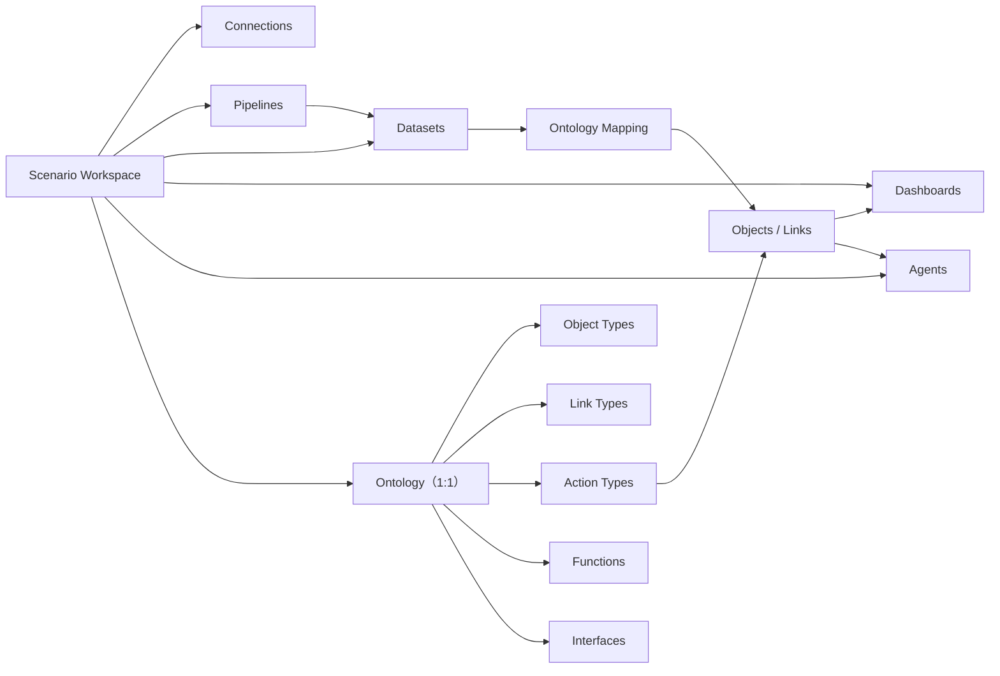

## 结论

当前项目已经具备一条完整的 Palantir-like 产品链路：

```text
数据连接
→ Pipeline
→ Dataset / 对象与关系
→ Object Explorer
→ Dashboard
→ Ontology-aware Agent
→ Action 写回
```

方向基本正确，特别是对象类型、关系类型、Action、Function、Object Set、对象投影、Agent 工具化访问这些概念，确实抓住了 Palantir Ontology 的核心。Palantir 官方也把 Ontology 定义为建立在 Dataset 等数字资产之上的运营语义层，包含对象、属性、关系，以及 Action、Function、动态安全等“行动能力”。[Palantir Ontology Overview](https://www.palantir.com/docs/foundry/ontology/overview)

但现在更准确的定位是：

> 产品闭环已经成形，控制面设计比较丰富，但执行面、作用域隔离、安全和公共契约还停留在原型期。暂时不能称为“实现协调良好的 Palantir-like 平台”。

最主要的问题不是开源组件用得少，而是平台语义尚未统一，部分地方又重新实现了开源组件本应提供的核心能力。

---

## 一场景一本体是否合理

合理，但建议严格区分两个概念：

- `Scenario Workspace`：用户工作的场景边界，拥有连接、Pipeline、Dataset、Dashboard、Agent。
- `Ontology`：语义边界，拥有 Object Type、Link Type、Interface、Action Type、Function。

现在可以保持两者 1:1，但不应该在代码和数据库中把它们当作同一个词随意互换。Palantir 当前也有 Space 与 Ontology 1:1 映射的模型，因此你的设想本身并不违背 Palantir-like 理念。[Palantir Ontologies](https://www.palantir.com/docs/foundry/ontologies/ontologies-overview)

推荐模型：



当前数据库却同时用 `ontology_id` 和 `workspace_id` 指向同一张 `control.ontologies` 表：[V11__multiple_ontologies.sql](/Users/dijkstra/project/06-shixi/Ontology/backend/ontology-core/src/main/resources/db/migration/V11__multiple_ontologies.sql:1)。前端因此被迫同时发送 `X-Ontology-Id` 和 `X-Workspace-Id`。这应当被视为待解决的架构债务，而不是长期接口设计。

---

## 当前各环节评价

| 环节 | 判断 | 主要问题 |
|---|---|---|
| 数据连接 | 原型较完整 | 探测、密钥、SSRF 防护做得不错；CSV/JDBC/Kafka/Pulsar 运行连接器较简陋 |
| Pipeline 控制面 | 设计较好 | 草稿、版本、校验、预览、运行记录、Flink 作业提交逻辑比较完整 |
| Pipeline 执行面 | 不合格 | DAG 实际被当成单条顺序链执行，AGGREGATE/WINDOW 声称支持但没有运行实现 |
| Dataset | 可演示，不可扩展 | 全量数据积存在 JVM、存 JSONL、OpenSearch scroll 后在 Java 内聚合 |
| 本体建模 | 概念基本正确 | 多本体与全局 revision 冲突；通用大 DTO 导致 API 弱类型 |
| 对象投影 | 架构方向合理 | HugeGraph 为对象事实、OpenSearch 为搜索副本是合理拆分；缺少 ontology_id 和真实权限 |
| Dashboard | 功能面完整 | Dataset 查询不扩展；部分指标只计算当前分页数据 |
| Agent | 理念很对 | 已做到 Ontology-first 和 Action 确认，但权限、Function 执行和会话隔离未完成 |
| OpenAPI | 需要重构 | 作用域缺失、Schema 过于自由、命名混乱，并且当前 lint 不通过 |

---

## 最严重的实现问题

### 1. 多本体与全局 revision 相互矛盾

V11 已经引入多个本体，但 `ontology_revisions` 仍然是平台全局的，没有 `ontology_id`：[V1__projection_control_plane.sql](/Users/dijkstra/project/06-shixi/Ontology/backend/ontology-core/src/main/resources/db/migration/V1__projection_control_plane.sql:3)。

发布某个本体时，代码会：

- 复制整个全局快照；
- 将全部 ACTIVE revision 设为 RETIRED；
- 激活一个新的全局 revision。

见 [ModelingService.java](/Users/dijkstra/project/06-shixi/Ontology/backend/ontology-core/src/main/java/com/hezhangjian/ontology/core/modeling/ModelingService.java:569)。

这意味着场景 A 发布一个对象类型，场景 B 的 revision 也会被推进。旧 ADR 选择的是“一个共享本体”，而 V11 改成了“多个本体”，但底层版本模型没有同步改完。

建议：`ontology_revisions`、snapshot、health、proposal、deployment、projection ledger 全部显式包含 `ontology_id`，并保证每个本体独立发布。

### 2. Flink 没有真正执行 Pipeline DAG

验证器对外声明支持：

- AGGREGATE
- DEDUPLICATE
- JOIN
- WINDOW
- 多输出分支

见 [PipelineGraphValidator.java](/Users/dijkstra/project/06-shixi/Ontology/backend/ontology-core/src/main/java/com/hezhangjian/ontology/core/pipelines/PipelineGraphValidator.java:35)。

但是运行时只是把所有节点拓扑排序后，在同一个 `row` 上依次执行：[PipelineTransform.java](/Users/dijkstra/project/06-shixi/Ontology/backend/flink-job/src/main/java/com/hezhangjian/ontology/flink/PipelineTransform.java:56)。

后果包括：

- 分支 DAG 会互相污染；
- 一个分支的 FILTER 可能让其他输出也消失；
- AGGREGATE、WINDOW 实际落入 `default`，什么都不做；
- DEDUPLICATE 使用非 checkpoint 的本地 `HashSet`；
- JOIN 把最多 1000 行辅助数据塞进节点配置；
- Kafka/Pulsar offset、sink 去重状态没有完整进入 Flink checkpoint。

因此当前 Flink 更像“启动一个单行解释器的作业容器”，还没有真正发挥 DataStream DAG、keyed state、window、checkpoint-aware connector/sink 的价值。

这是目前最高优先级的技术问题。要么真正编译成 Flink operators，要么立即收缩对外能力，只允许严格单链 Pipeline，并移除未实现节点。

### 3. 本体隔离不是安全边界

[WorkspaceContext.java](/Users/dijkstra/project/06-shixi/Ontology/backend/ontology-core/src/main/java/com/hezhangjian/ontology/core/security/WorkspaceContext.java:42) 会优先读 `X-Workspace-Id`，再读 `X-Ontology-Id`，但不会验证：

- 本体是否存在；
- 当前用户是否属于该本体；
- 当前用户对资源是否有权限。

同时 ontology-core、agent-runtime、BFF 目前均为 `permitAll`，ontology-core 自动注入本地管理员：[ResourceServerSecurity.java](/Users/dijkstra/project/06-shixi/Ontology/backend/ontology-core/src/main/java/com/hezhangjian/ontology/core/security/ResourceServerSecurity.java:25)。

作为 README 所说的本地免登录阶段可以接受，但上线前必须建立：

- Workspace/Ontology membership；
- 资源级权限；
- 对象行级、属性级权限；
- Action submission policy；
- Agent 继承调用者权限。

这也是 Palantir-like 的核心，而不是附加功能。Palantir 将对象类型权限、数据源权限、对象与属性安全策略分开处理。[Palantir Ontology Permissions](https://www.palantir.com/docs/foundry/object-permissioning/ontology-permissions)

### 4. 投影事件缺少 ontology_id

[OntologyEventEnvelope.java](/Users/dijkstra/project/06-shixi/Ontology/backend/platform-contracts/src/main/java/com/hezhangjian/ontology/contracts/projection/OntologyEventEnvelope.java:10) 只有 `ontologyRevision` 和 `objectType`，没有 `ontologyId`。

OpenSearch 文档也只有 `object_type` 和统一的 `visibility_tokens=["authenticated"]`：[OpenSearchProjectionClient.java](/Users/dijkstra/project/06-shixi/Ontology/backend/projection-worker/src/main/java/com/hezhangjian/ontology/projection/storage/OpenSearchProjectionClient.java:118)。

建议事件身份至少包含：

```text
ontology_id
ontology_revision
object_type_physical_key
object_id
object_version
security_policy_version
```

否则本体隔离、安全过滤、独立重建和审计都只能依赖外围约定。

### 5. Function 和 Action 只完成了部分能力

Function 在 Core 的测试接口只校验 DSL，固定返回空 rows：[ModelingService.java](/Users/dijkstra/project/06-shixi/Ontology/backend/ontology-core/src/main/java/com/hezhangjian/ontology/core/modeling/ModelingService.java:510)。真正的 Function 解释器却写在 Agent Runtime 中：[OntologyToolClient.java](/Users/dijkstra/project/06-shixi/Ontology/backend/agent-runtime/src/main/java/com/hezhangjian/ontology/agent/OntologyToolClient.java:110)。

这会让 Agent、Dashboard、API 对同一个 Function 得到不同语义。Function 应由一个统一的 Ontology Function Runtime 执行，所有消费者调用它。

Action 也类似：API 声明 CREATE、UPDATE、RETIRE、LINK、UNLINK，但执行器当前只实现 `SET_PROPERTY`：[ModelingService.java](/Users/dijkstra/project/06-shixi/Ontology/backend/ontology-core/src/main/java/com/hezhangjian/ontology/core/modeling/ModelingService.java:405)。`approvalPolicy=ALWAYS` 目前只显示“需要 Resource Owner”，执行阶段并不真正审批。

Palantir 的 Action 是跨应用复用的一致事务与验证入口，而不是某个 UI 的属性更新表单。[Palantir Action Types](https://www.palantir.com/docs/foundry/action-types/overview)

---

## OpenAPI 为什么显得乱

你的直觉是对的。当前文件有：

- 2,534 行；
- 145 个 path；
- 177 个 operation；
- 59 处 `additionalProperties: true`；
- 只有 Data Source 集合接口声明了 `X-Workspace-Id`；
- Agent 和 Modeling 实际要求 `X-Ontology-Id`，契约却没有定义；
- `ModelingResourceDraft` 同时容纳对象、关系、接口、Action、Function 的全部字段；
- `/ontologies` 的 operationId 却叫 `listScenarioWorkspaces`；
- 全局 bearerAuth 与实际 `permitAll` 不一致。

现有 Redocly 校验结果是 **3 个错误、49 个警告**，其中一个错误来自未加引号的 inline YAML summary。

建议采用两层资源结构：

```text
/v1/scenarios/{scenarioId}/connections
/v1/scenarios/{scenarioId}/pipelines
/v1/scenarios/{scenarioId}/datasets
/v1/scenarios/{scenarioId}/dashboards
/v1/scenarios/{scenarioId}/agents

/v1/ontologies/{ontologyId}/object-types
/v1/ontologies/{ontologyId}/link-types
/v1/ontologies/{ontologyId}/interfaces
/v1/ontologies/{ontologyId}/action-types
/v1/ontologies/{ontologyId}/functions
/v1/ontologies/{ontologyId}/object-types/{objectTypeId}/objects
```

如果暂时不准备区分 Scenario 和 Ontology，也可以全部统一成 `/v1/ontologies/{ontologyId}/...`。关键是不要再通过两个 Header 隐式选择同一个资源边界。

同时拆开请求模型：

- `ObjectTypeDraft`
- `LinkTypeDraft`
- `InterfaceDraft`
- `ActionTypeDraft`
- `FunctionDraft`

不要继续使用一个巨大的 `ModelingResourceDraft`。

---

## 开源组件是否真正发挥了作用

- **PostgreSQL：发挥较好。** 控制面、版本、审计、幂等、任务状态的定位合理。
- **HugeGraph：真实使用且职责合理。** 承担对象与关系事实存储；需要补租户隔离、批量遍历和查询效率。
- **OpenSearch：对象搜索用途合理，Dataset 用途过重。** 不应 scroll 全量数据到 JVM 后再计算。
- **Pulsar：真实使用。** 但和 Flink 的 checkpoint、ack、exactly-once/idempotency 边界没有协调完整。
- **Flink：严重低效使用。** 使用了作业提交和 checkpoint 外壳，却重新实现了 DAG、去重、Join、Source、Sink 等关键运行语义。
- **MinIO：真实使用。** 但 Dataset 设计文档要求 Parquet，实际写的是单个 JSONL，并在内存一次构造完整内容：[DatasetStorageClient.java](/Users/dijkstra/project/06-shixi/Ontology/backend/ontology-core/src/main/java/com/hezhangjian/ontology/core/datasets/DatasetStorageClient.java:39)。
- **APISIX、SkyWalking、OpenTelemetry：Compose 层面接入合理。** Compose 配置验证通过。
- **BFF：目前基本为空。** 若不承担聚合、权限适配或前端专用协议，可以暂时移除，避免假模块。
- **Ant Design、Ant Design Charts、XYFlow、Zustand：确实在使用。** 前端构建、类型检查和 lint 都通过；不过构建产物主 bundle 约 2 MB，后续需按页面拆包。

不要把“包装开源组件”本身视为错误。应该保留薄适配层，用来处理认证、超时、重试、错误映射和指标；不应该在适配层重新实现 Flink 状态语义、Pulsar 投递语义、分析引擎或标准文件格式。

---

## 推荐改造顺序

### P0：先让平台语义正确

1. 明确 Scenario 与 Ontology 的 1:1 模型和命名。
2. revision、event、projection、query 全链路增加 `ontology_id`。
3. 统一作用域传递，移除双 Header。
4. 修复 Flink DAG；完成前禁用分支、AGGREGATE、WINDOW 和不可靠的 streaming。
5. 建立真实身份与本体成员权限。
6. 修复 OpenAPI，使 lint 成为 CI 强制门禁。

### P1：统一平台能力

1. 建立唯一 Function Runtime。
2. 补全或收缩 Action 类型及审批能力。
3. Dataset 改为分片 Parquet/对象存储写入，避免内存收集全量记录。
4. Dashboard 聚合统一下推查询引擎；当前非 count METRIC 只计算当前分页数据：[DashboardService.java](/Users/dijkstra/project/06-shixi/Ontology/backend/ontology-core/src/main/java/com/hezhangjian/ontology/core/dashboards/DashboardService.java:754)。
5. 修复对象 Activity 使用 apiName 而投影使用 physicalKey 的不一致：[ExplorerService.java](/Users/dijkstra/project/06-shixi/Ontology/backend/ontology-core/src/main/java/com/hezhangjian/ontology/core/explorer/ExplorerService.java:191)。

### P2：再谈扩展和新增组件

先不要继续增加更多中间件。等数据规模明确后，再决定是否需要 Iceberg/Trino 一类 Dataset 查询层。当前最缺的不是新组件，而是已有组件之间明确、可验证的责任边界。